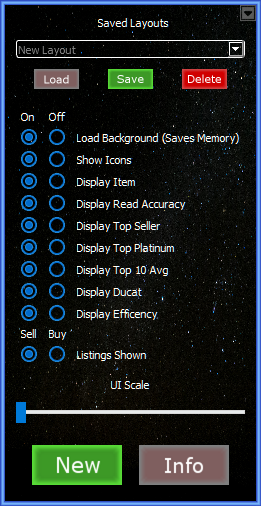

# Warframe Market Overlay

This is an overlay written in Python for the purpose of reading the screen in Warframe, and reporting the values from warframe.market associated with that item.

This was one of my first major projects I worked on, and never completely finished to the degree I would have liked to. Now I have decided to release this on Github so that this extremely handy tool doesnt just sit in a folder on my computer collecting e-dust.

Currently the program is full operational, however, it is not highly optimized, doesn't have all the features I had planned for it, also there are a few bugs that could be worked out. Currently I plan to work on it when time allows, and I would certainly look at any pull requests.

## Prerequisites

You will need to install python (designed and tested in Python 3.7.0)<br />
https://www.python.org/downloads/

Once python is installed you will need to install the required packages, Included in the repo is a requirements.txt to make your life easy.<br />
```
pip install -r requirements.txt
```


You will also need to install a version of tesseract. (designed and tested using v5.0.0 Alpha.20190708 however any version should work)<br />
https://github.com/tesseract-ocr/tesseract (Source Code)<br />
https://digi.bib.uni-mannheim.de/tesseract/ (Assembled Binaries)

Make sure it is in your windows path variable. (for pytesseract to be able to find it)<br />
Otherwise you will have to edit imagemethodcalc.py to find the .exe, theres a placeholder example commented out in there already.


## How to use

Once you have done the above steps all you should need to do is run the script with command prompt.<br />
```
python overlay.py
```

## How to use


Immediately, on the first run it will be set up for the relic rewards screen, at 1920x1080.

The image above shows what you will see while using it, there is a "Search Window", which is movable and resizable. Paired with it is an "Info Window", which is also movable. This will tell you all the info it can find on that item.


The info Window will show you all the relevant information for the item being scanned.

"Item" The name of the item scanned.<br />
"Accuracy" The % read accuracy. How sure the program is, that the text it was reading is what is being displayed.<br />
"Top Seller" The name of the player who is selling this item the cheapest.<br />
"Top Plat" What the cheapest listed price is.<br />
"Top 10 Avg" What the average of the top 10 listings are.<br />
"Ducats" How many ducats the item is worth.<br />
"Efficency" The Ducat/Platinum efficency is based off of the top seller.


Most windows have a drop down menu that will do a variety of things.

"New" opens a new search/info window.<br />
"Close" closes the current window.<br />
"Setting" opens the settings window for that info window.<br />
"Main" opens the main window.<br />
"Close all" closes all windows and reopens the main window.


For each of these windows there is a settings window, which can control what is displayed on each info window.

You can choose between the global settings, and on or off.<br />
Each list item is self explanitory, given you have read the above section on the info window.


If you are ever having a hard time figuring out which windows are tied to each other, you can double click and it will highlight the attached windows.



Here you can load, save, and delete saved layouts. This feature is so you can create your own easily loadable layouts, so you dont have to reposition windows all the time if you are scanning areas other than the relic reward screen.

If you choose the "default" option on the drop down menu, and save, that will be what opens whenever you first start the program.

<br/>
There is 2 new options at the top compared to what is in the individual settings windows.

"Load Background" Turning this off will unload the background picture which will save about 100MB of ram.<br />
"Show Icons" This determines whether or not the relic, platinum, and ducat pictures are displayed on the info windows.

<br/>
You can determine also which listing type is displayed.

"Sell" will show the WTS (Want To Sell) listings from warframe.market<br />
"Buy" will show the WTB (Want To Buy) listings

<br/>
You can increase the UI scale up to 2x, using the slider at the bottom, this was mostly done to help support 4k monitors.

<br/>
You can also create a new scan window with the "New" button at the bottom<br/>
The "Info" Button will take you to the Readme on GitHub

# Thanks

Thanks to everyone at Digital Extremes for creating and maintaining Warframe.<br />
https://www.warframe.com/

Thanks to 42 Bytes for creating and maintaining warframe.market.<br />
https://warframe.market/<br />
https://www.patreon.com/42Bytes


Thanks to everyone who helped me along this coding journey.

Thanks to you the reader/user who was part of the why behind doing this.

Code by Jonathan Sourdough
